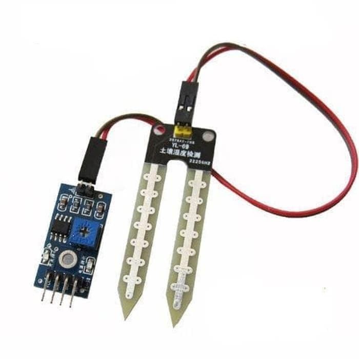
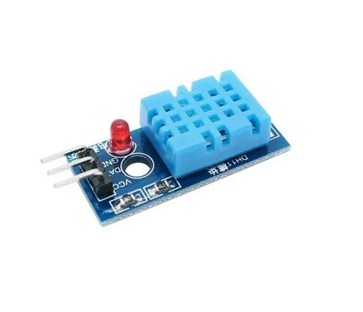
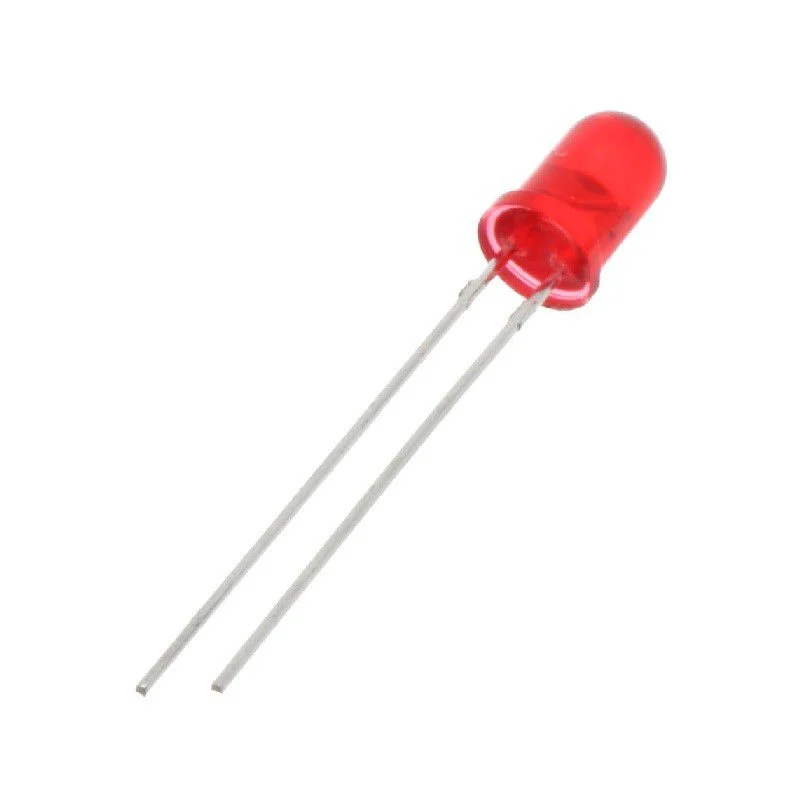
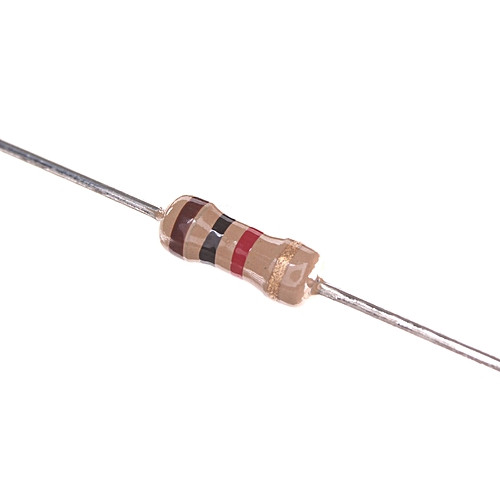
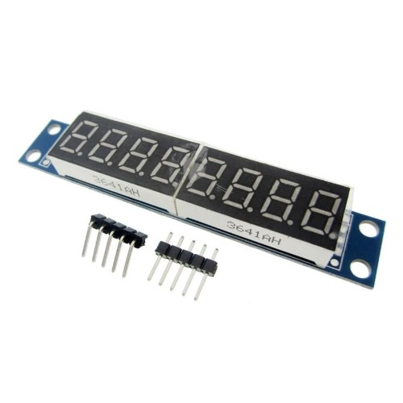
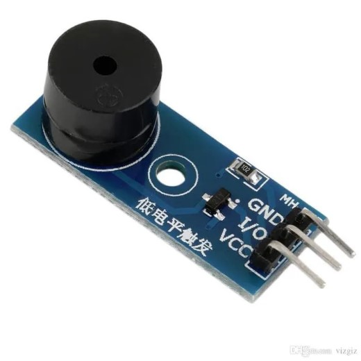
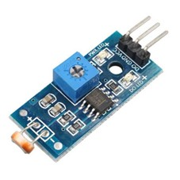
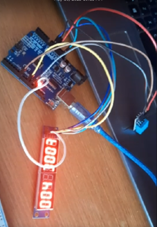
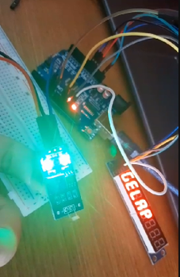

# Plant-Monitoring-System

## I. Introduction to the problem and the solution
Plant monitoring system is an arduino based automated system to monitor the status of your plants in order to provide them with the highest quality environtment to maximize growth quality. The system will monitor certain environtment quality such as soil moisture, sorrounding environtment temperature, and humidity of air. 3 LEDs will act as indicators of environtment quality ranging from healthy to critical.

The problem that necessitates the existence of the Plant Monitoring System is the challenge of effectively monitoring and maintaining optimal environmental conditions for plants. In traditional plant care practices, it can be difficult for individuals to accurately determine the specific needs of different plant species in terms of moisture levels, temperature, and light requirements. This lack of precision often results in suboptimal plant health, leading to stunted growth, disease susceptibility, or even plant mortality.

The Plant Monitoring System addresses this problem by providing an automated and precise monitoring solution for plant care. The system incorporates sensors to measure key environmental parameters such as moisture levels, temperature, and light intensity. By collecting and analyzing this data, the system can provide real-time feedback and notifications to users, alerting them to any deviations from the optimal conditions for plant growth. Additionally, the system can offer recommendations and actionable insights to guide users in adjusting the environmental factors to maintain healthy plant growth.

## II. Hardware design and implementation details
The hardware and design implementation of the Plant Monitoring System involves several components and considerations to ensure accurate monitoring and reliable performance. The following are the key hardware components and design considerations for the system:

### Components:
**1. Arduino UNO R3**
<p align="center" width="100%">
     
</p>

**2. YL39 sensor**
<p align="center" width="100%">
     
</p>

**3. DHT11 sensor**
<p align="center" width="100%">
     
</p>

**4. 3 LEDs**
<p align="center" width="100%">
     
</p>

**5. Resistors**
<p align="center" width="100%">
     
</p>

**6. MAX7219**
<p align="center" width="100%">
     
</p>

**7. Buzzer**
<p align="center" width="100%">
     
</p>

**8. LDR Module**
<p align="center" width="100%">
     
</p>

This system is built around an Arduino microcontroller, which serves as the central processing unit. The Arduino board provides the necessary computational power and interfaces to connect and control various hardware modules.

Sensors:

**a. Moisture Sensor:** A moisture sensor YL39 is used to measure the moisture level in the soil or growing medium. It is connected to the Arduino board via digital input pins.

**b. Temperature and Humidity Sensor:** A temperature and humidity sensor, such as the DHT series sensor, is utilized to measure ambient temperature and humidity. This sensor is connected to the Arduino board through digital input/output pins.

**c. Light Sensor:** A light-dependent resistor (LDR) is used to measure the intensity of light in the plant's environment. The LDR is connected to the Arduino board through digital input pins.

A display module (MAX7219 seven segment display) is incorporated to provide real-time feedback and visualization of the sensor readings and system status. The display module is connected to the Arduino board through appropriate communication protocols such as SPI.

## Software
### [Ardunio IDE 2](https://www.arduino.cc/en/software)
Arduino IDE 2 will be used to flash the program into the arduino via USB type B cable.
### AVR Assembly
The program is fully written in AVR Assembly, thus it is designed and only tested on Arduino UNO R3, specifically ATMega328p processor. This was not tested on any other device.

## Software implementation details
We use the Arduino IDE to program using assembly language. Assembly programming is done by programming each component individually from DHT11, YL39, and also MAX 7219. These three components can be programmed via the Arduino Uno R3 microcontroller based on the ATMega28p chip.

The software code that we programmed will direct how the Arduino behave. Our most important feature is to show the reading from the sensors to the Max7219. The code will allow us to determine how the sensors and Max7219 send each other data. The code will also be used to determine the status of the LED, for the full table of LED status is down below:

| Status |  GREEN  | YELLOW   | RED   |
| ------ | ------- | -------- | ----- |
| M / T  | ON      | OFF      | OFF   |
| M / G  | OFF     | ON       | OFF   |
| D / T  | OFF     | ON       | OFF   |
| D / G  | OFF     | OFF      | ON    |

Notes:
* M = Moist 
* T = Terang
* G = Gelap
* D = Dry

## Test results and performance evaluation
The Plant Monitoring System project was developed using Arduino assembly to create an automated system for monitoring the health and environmental conditions of plants. To ensure the reliability and functionality of the system, rigorous testing was conducted at various stages of development. This section outlines the testing methodologies employed and the results obtained.

Integration testing aimed to assess the seamless integration of all the individual components and modules of the Plant Monitoring System. The objective was to ensure that data flow and communication between various modules were functioning as expected. Test cases were designed to simulate different scenarios. The system was tested for stability, responsiveness, and data accuracy during these scenarios.

In this case, we tested the system integrating only the DHT sensor and MAX7219 first to see if those two components can communicate and display the correct reading. Next, we also tested moisture sensor and MAX7219, along with just the LDR sensor with MAX7219 only. 

All individual components passed the unit testing phase successfully. The moisture sensor provided accurate moisture level readings, the temperature sensor measured the ambient temperature accurately, and the LCD display exhibited the correct output.

<p align="center" width="100%">
     
</p>

The integration testing phase verified that the components of the Plant Monitoring System were effectively integrated. Data flow between modules was smooth, and the system provided accurate and real-time readings of environmental parameters for multiple plants.

<p align="center" width="100%">
     
</p>

User acceptance testing demonstrated that the system, when all the components are connected and used together in order to try it in the real-world environment has successfully outputted a correct reading of the environment temperature which was displayed on the MAX7219, the moisture level and the light level have also been successfully displayed on the display this is showed by the display showing the status as one of GELAP, TERANG, DRY, MOIST.

In conclusion, the testing process for the Plant Monitoring System encompassed unit testing, integration testing, and user acceptance testing. The system passed all testing phases successfully, exhibiting accurate readings, seamless integration, efficient performance, and positive user feedback. These tests assure the reliability and functionality of the Plant Monitoring System, making it a valuable tool for plant enthusiasts and professionals alike.

## Conclusion
Plant Monitoring System is an Arduino Uno project that is fully coded in Assembly Language and is used to monitor factors that impact the plants such as soil moisture level, light intensity, temperature and humidity using three sensors that is YL38, DHT11, and LDR. Then show that reading to MAX7219. After that the LEDs will light up according to the truth table that has been set.  

This project will be able to make plant monitoring more efficient, reliable and less time-consuming. This project also is user friendly towards small farmers / gardeners because it’s cost efficient and easy to implement. But at the same time this project is easy to scale up so that big farms can also use this project as well. 

Through this project we used and learn various hardware such as all the sensors and the Arduino itself, we first tried to make this project in Protheus in which it worked really well and according to what we wanted. But when we tried to assemble and integrate the hardware and software, we faced some difficulties along the way. The most prominent one was working with Max7219 that sometimes doesn’t show the accurate reading of the sensors and even sometimes it bugged out and doesn’t show the output at all. 

But through all those difficulties in the end we managed to fix all the problems and make sure that everything worked accordingly. We learn the importance of the quality of the material because it impacts greatly on how the hardware worked. Overall, this project was a really fun learning experience for us.

## Future Work
Plant Monitoring System in it's current state has done it's job well but there are a lot of things that can be improved on such as : 
* Feature to automatically pour water when the soil moisture is dry
* Upscale the project so it can accommodate bigger farms.

## How to Use
1. Connect all hardware following the Connection Diagram
2. Clone the repository
```
git clone https://github.com/juanjonathan67/Plant-Monitoring-System.git
```
3. Open Plant-Monitoring-System with Arduino IDE 2
4. Connect the Arduino to your computer using a USB type A to type B cable
5. Make sure it has successfully connected by checking COM port (Windows) or /dev/ttyUSB0 (Ubuntu)
6. Set the board to be Arduino UNO R3
7. Upload by clicking the arrow key icon next to the checklist icon

## Contributors
